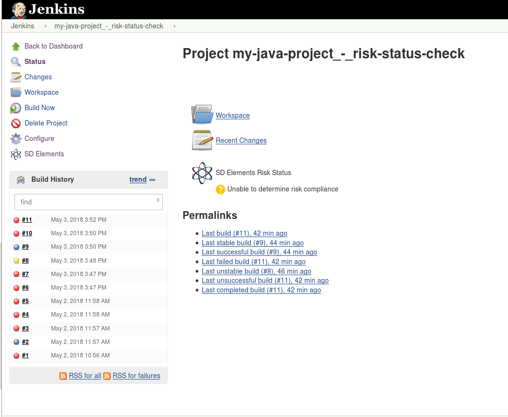
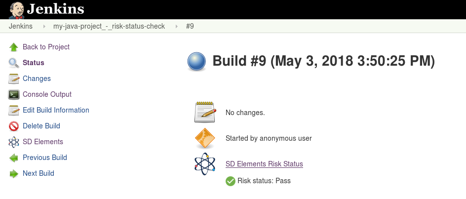
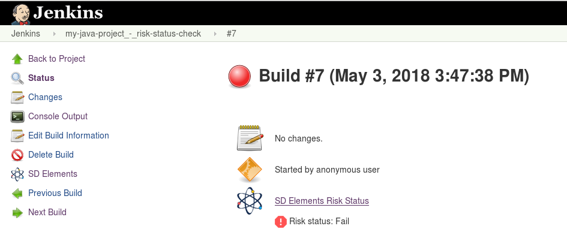
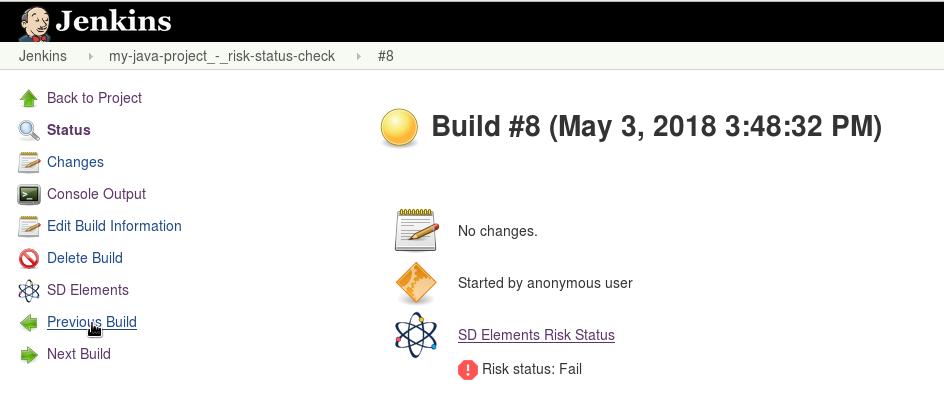
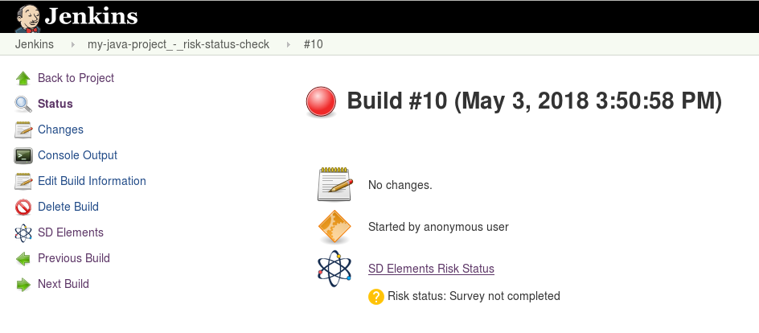

# Jenkins SD Elements plugin

[](https://travis-ci.org/Praqma/sdelements-plugin
)

Jenkins integration for [SD Elements risk assessment](https://www.securitycompass.com/sdelements) by [Security Compass](https://www.securitycompass.com/).

Add a post-build action to pass/fail your job, based on the status of the risk assessment.

Development is in progress - no public release yet.

Developed by Praqma, funded by Security Compass

## Features

* Configure SD Elements servers in Jenkins global configuration (Jenkins -> Configure system)
* Configure post-build action in Jenkins job to check for risk compliance:
  * Configure project ID from SD Elements
  * Chose SD Elements server (from the one configured globally)
* Post-build step will query project risk compliance:
  * Risk status pass allows successful build
  * Risk status fail fails the build, but configuration allows to set unstable
  * Failure to determine risk status will fail the build, error message can be found in build console output
  * If mandatory SD Element project survey isn't completed, job fails

UI and summary:

* Left menu `SD Elements` links SD Elements server URL configured for the job
* In summary section `SD Elements Risk Status` links to the project page in SD Elements for the project configured in the job

## Getting started

_See also screenshots below_.

### Downloading a pre-release version

If you're not using the update center, you can download the latest plugin (`.hpi`) release from this page: https://github.com/Praqma/sdelements-plugin/releases

### Installing plugin from .hpi file

In Jenkins you go to `manage plugins` -> `advanced` -> `upload plugin` and select the `.hpi` you just downloaded.

Remember, when doing manual install plugin dependencies are **NOT** installed, so for this plugin you'll need to install the [Plain Credentials Plugin](https://wiki.jenkins.io/display/JENKINS/Plain+Credentials+Plugin) first.

### Configuring credentials

The plugin only supports the usage of credentials using a generated token. You need to generate a token in SD Elements for your user that can read the status of projects. You do that by clicking `<your name>` in the upper right corner, and the `api` and then you generate your token by clicking the `Generate` button.

Once you've created your SD Elements token you need to create an instance of your SD Elements server configuration in Jenkins:

`Manage Jenkins` -> `Configure system` -> `Security Compass SD Elements configuration`

Fill in a chosen name for the connection, server address and add a credential to use. For this you need to use the `Secret text` where you put in your generated api token.

### Finding your project id

In order to obtain your project id for use in a job, you need to log into SD Elements using a browser first. Use your username and password.

Then browse this address (same browser window): `<your_sd_elememts_server>/api/v2/projects/`. This gives you a json response. Inside the response you'll find a number of entries like: `"id":`. These are the project id's you need. The name of the project is in the following `"slug"` element.

### Configuring your job

Once you've determined the project id to use, and have setup a server you can go ahead a configure a job, in the job configuration page click the following:

`Add post-build action` -> `SD Elements`

Select your configured sd elements server and fill in the project id you've just obtained.

## Screenshots

### Jenkins -> Configure System

Also called global configuration:


  * Credentials must be type `Secret text`, where you supply the SD Elements API token.


### Project page (job page)

Shows latest status for last build checking risk status.

Below it **Shows unable to determine risk compliance**, e.g. when it can be found due to configuration errors like wrong server URL, authentication and like. Check console log for description of the problem.

    Invalid token in credentials
    401 Unauthorized
    SD Elements compliance status: Undetermined
    Build step 'SD Elements' changed build result to FAILURE



### Build pages

Build pages shows historic results for each builds, but the graphics are the same as on the project page. Examples:


**Build successful when risk status pass:**


**Build fails when risk status fails:**


**Configuration can set build status unstable when risk status fails:**


**Build will fail when mandatory survey in SD Elements isn't completed:**



# Developer information

## GitHub Travis setup

### Releases

We've configured travis releases using the cli with the following commands:

```
$ travis setup releases
Username: ReleasePraqma
Password for ReleasePraqma: **********
File to Upload: target/sdelements.hpi
Deploy only from Praqma/sdelements-plugin? |yes| yes
Encrypt API key? |yes| yes
```

The `.travis.yml` was modified slightly we added the tags flag to the deployment section:

```
language: java
jdk:
- oraclejdk8
install: true
cache:
  directories:
  - "$HOME/.m2"
script:
- mvn package |  egrep -v 'Download(ing|ed)'
deploy:
  provider: releases
  api_key:
    secure: SEFzWVEG6H9Zcu7wOzYueGfhAisGiF7o/cMocTdYvGG1z4WwIUtHb1AfKmxbyWna72kybHtdBjnMAJ8l7gwp7UOPpHKsIkBKQ5SXa3S/2Fqj7Aq2UFioeqklqDpOlYSobUyp9epUTJnTwFTUFN4hYKxQG2ZL89xTNk3+5UxRsyH9KbL/4c6Gs8WRpmLKn0h1EHSGHw$
  file: target/sdelements.hpi
  skip_cleanup: true
  on:
    tags: true
```
